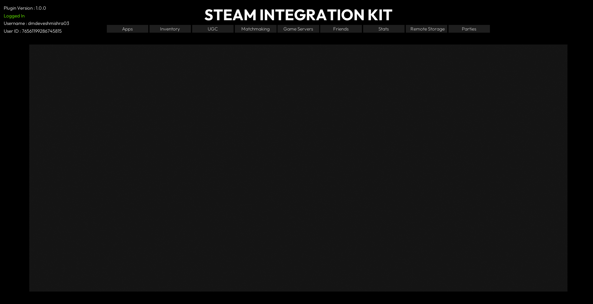

# Example Project

This is an example project that you can use to get started with your own project.

Screenshot of the example project:

  

More images of the example project can be found on the Marketplace page.

## Download Example Project

You can download the example project from the link below:

[Download Example Project](https://github.com/betidestudio/SIK-Example-Project)

## Setup Example Project

Although the example project is ready to use, you will have to use your own configuration to make it work.