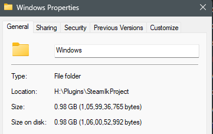
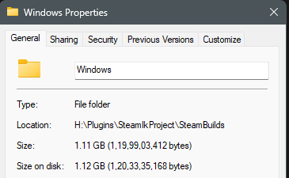
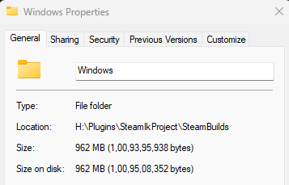
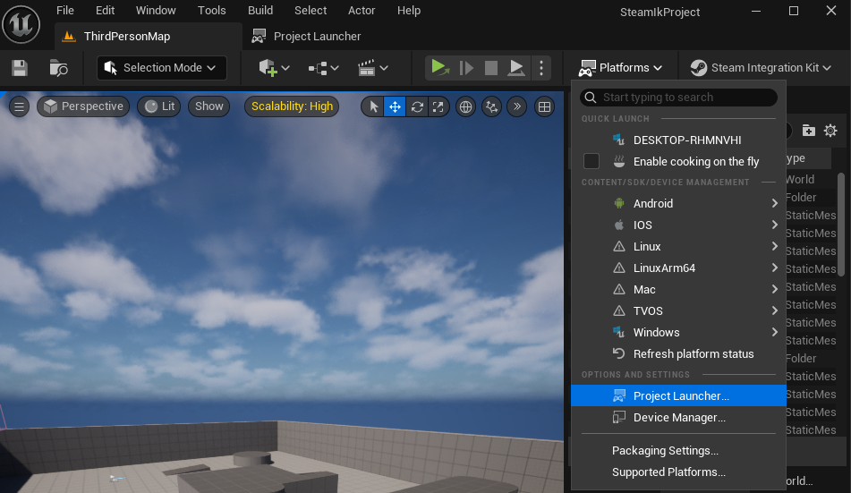
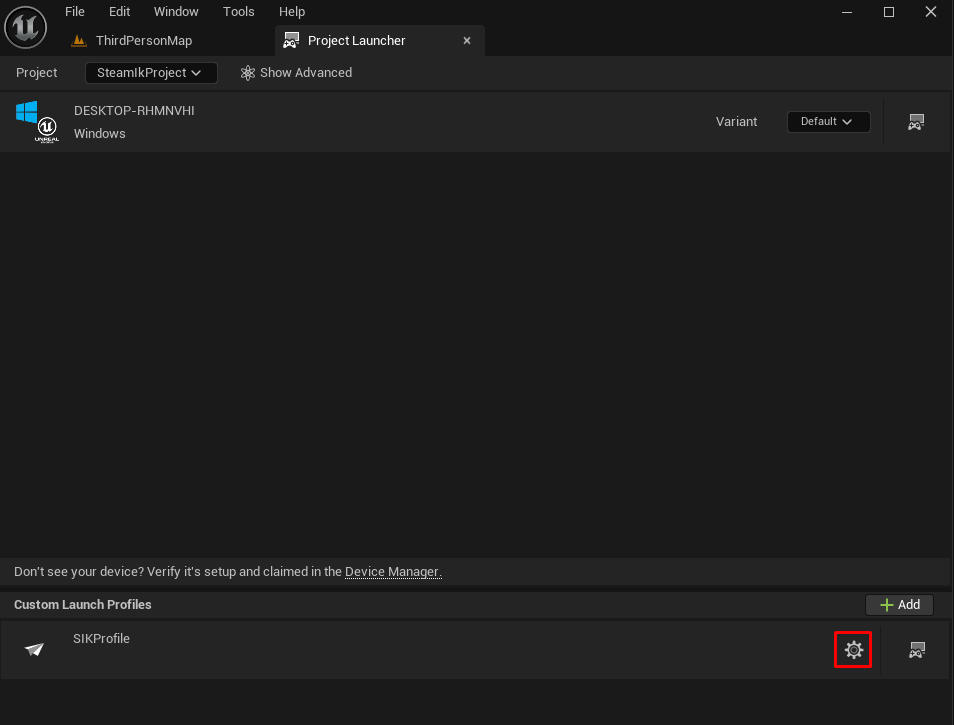
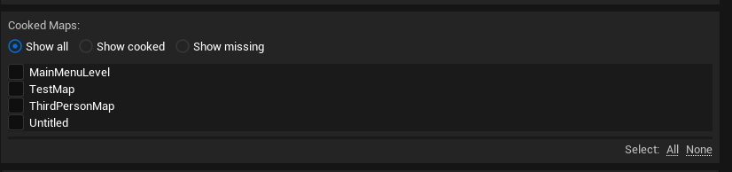
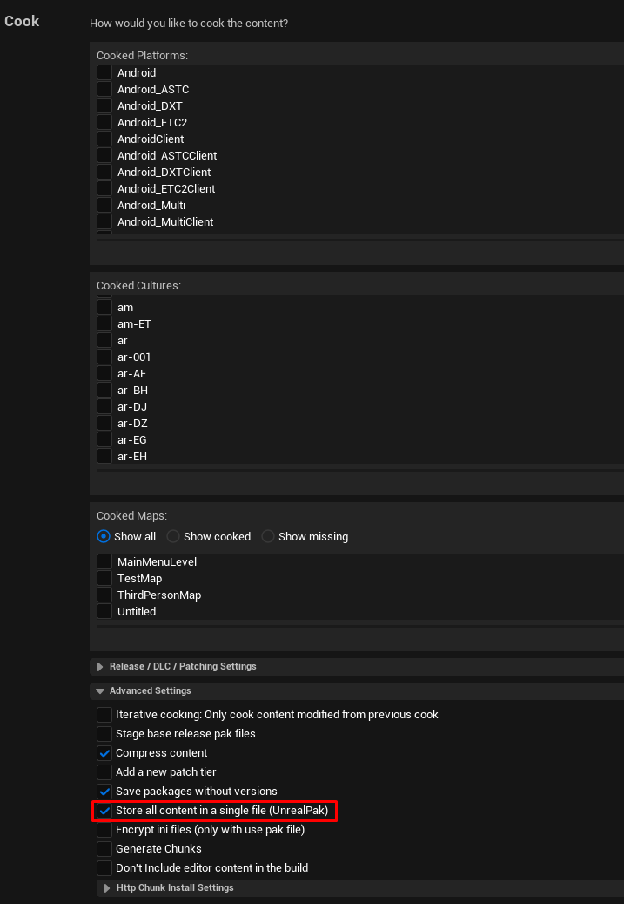

import { Callout } from 'nextra/components'
import { Steps } from 'nextra/components'

# One Click Package and Deploy
<Callout type="info">
    **Note**: The One Click Package and Deploy feature is only available if you your own  Steam ID and have access to the Steamworks backend. This does not work with the default Steam ID(480).
</Callout>
## Overview

The One Click Package and Deploy feature allows you to package and deploy your Steam Builds with just one click. This feature is available for:

- Windows
- Mac (coming soon)
- Linux (coming soon)

## Setup 

To use the One Click Package and Deploy feature, you need to follow these steps:

<Steps>
### Plugin Settings
 
Go to **Edit > Project Settings > Game > SteamIntegrationKit** and make sure the following settings are set:

- **Steam App ID**: Enter your Steam App ID.
- **Username**: Enter the username of your Steam account OR the username of the Steam account that has access to the Steamworks backend.
- **Password**: Enter the password of your Steam account OR the password of the Steam account that has access to the Steamworks backend.
- **Branch Name**: Enter the branch name of your Steam build (e.g. live, dev, etc.).
- **Build Description**: Enter the description of your Steam build but you can modify it later in the Steamworks backend.
- **Build Config**: Select the build configuration (e.g. Development, Shipping, etc.).
- **Maps to Package**: Enter the maps that you want to package (e.g. Map1, Map2, etc.). If you want to override this setting, please scroll down to the **Advanced Settings** section.

<Callout type="warning">
    **Note**: The **Username** and **Password** can also be set in the Window's environment variables. If you set the **SIK_STEAM_USERNAME** and **SIK_STEAM_PASSWORD** in the environment variables, you don't need to set them in the plugin settings. On project restart, the plugin will automatically fetch the **SIK_STEAM_USERNAME** and **SIK_STEAM_PASSWORD** from the environment variables and show them in the plugin settings. This is helpful if you want to keep your **Username** and **Password** secure and do not want to push them to the repository.
</Callout>
 
### Create Packaging Profile
 
On the main toolbar, click on SIK > Create/Reset Packaging Profile. This will create a new packaging profile for your project.
  

We use packaging profile so that you can play with the settings and modify them according to your needs. 

You should now see a new packaging profile in the **Packaging Profiles** section and you can modify the settings according to your needs.

### Login to Steamworks Backend

To generate a token for the One Click Package and Deploy feature, you need to login to the Steamworks backend.

On the main toolbar, click on SIK > Login to Steamcmd. This will open a popup window where you need to enter your SteamGuard code (if enabled) and then click on **Login**.

  

Please check the output log to see if the login was successful.

This is a one-time process and you don't need to login again unless you logout or the token expires.

### Package and Deploy

Now we are done! To package and deploy your Steam Build, click on SIK > Package and Deploy. This will start the packaging process and you can check the output log to see the progress.

  

</Steps>

## Packaging Size Issue

When you package your project normally, the size of the packaged build is usually lower than the size of the build that is packaged using the One Click Package and Deploy feature. This is because the One Click Package and Deploy feature uses the Package Launcher to package the build which requires additional modifications to decrease the size of the packaged build.

**Initial Size through Normal Packaging**: 0.98 GB

  

**Initial Size through Project Launcher (SIK)**: 1.11 GB

  

**Final Size through Project Launcher (SIK)**: 0.96 GB

  

Now, to decrease the size of the packaged build, you can follow these steps:

### Step 1 - Open Project Launcher

For many, Project Launcher is a new concept. It is a tool that allows you to package your project with additional settings and modifications. It can be found in the main toolbar under **Platforms > Project Launcher**.

  

### Step 2 - Open Packaging Profile

In the Project Launcher, you can see a list of packaging profiles that you or the One Click Package and Deploy feature has created. Press the **Settings** button to open the packaging profile for the **SIKProfile**.

  

### Step 3 - Modify Settings

Basic settings like **Cooked Maps** under **Cook** form the core of sizing issues. You can modify these settings according to your needs.

  

Now, the *main* thing, to make it similar to the size of the packaged build, you need to enable the **Store all content in a single file(UnrealPak)** option under **Cook > Advanced Settings**.

  

That is it! Now you can package your project using the SIK and the size of the packaged build will be similar to the size of the build that is packaged using the normal packaging process.