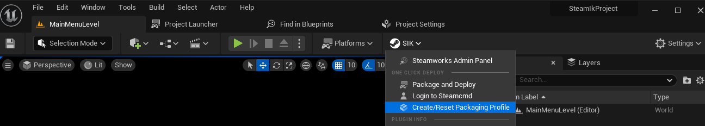

import { Callout } from 'nextra/components'
import { Steps } from 'nextra/components'

# One Click Package and Deploy
<Callout type="info">
  As you may know, the One Click Package and Deploy feature is still in beta and we are working on improving it. If you face any issues, please let us know on our [Discord Server](https://discord.gg/betidestudio).

    **Note**: The One Click Package and Deploy feature is only available if you your own  Steam ID and have access to the Steamworks backend. This does not work with the default Steam ID(480).
</Callout>
## Overview

The One Click Package and Deploy feature allows you to package and deploy your Steam Builds with just one click. This feature is available for:

- Windows
- Mac (coming soon)
- Linux (coming soon)

## Setup 

To use the One Click Package and Deploy feature, you need to follow these steps:

<Steps>
### Plugin Settings
 
Go to **Edit > Project Settings > Game > SteamIntegrationKit** and make sure the following settings are set:

- **Steam App ID**: Enter your Steam App ID.
- **Username**: Enter the username of your Steam account OR the username of the Steam account that has access to the Steamworks backend.
- **Password**: Enter the password of your Steam account OR the password of the Steam account that has access to the Steamworks backend.
- **Branch Name**: Enter the branch name of your Steam build (e.g. live, dev, etc.).
- **Build Description**: Enter the description of your Steam build but you can modify it later in the Steamworks backend.
- **Build Config**: Select the build configuration (e.g. Development, Shipping, etc.).
- **Maps to Package**: Enter the maps that you want to package (e.g. Map1, Map2, etc.). If you want to override this setting, please scroll down to the **Advanced Settings** section.
 
### Create Packaging Profile
 
On the main toolbar, click on SIK > Create/Reset Packaging Profile. This will create a new packaging profile for your project.
  

We use packaging profile so that you can play with the settings and modify them according to your needs. 

You should now see a new packaging profile in the **Packaging Profiles** section and you can modify the settings according to your needs.

### Login to Steamworks Backend

To generate a token for the One Click Package and Deploy feature, you need to login to the Steamworks backend.

On the main toolbar, click on SIK > Login to Steamcmd. This will open a popup window where you need to enter your SteamGuard code (if enabled) and then click on **Login**.

  

Please check the output log to see if the login was successful.

This is a one-time process and you don't need to login again unless you logout or the token expires.

### Package and Deploy

Now we are done! To package and deploy your Steam Build, click on SIK > Package and Deploy. This will start the packaging process and you can check the output log to see the progress.

  

</Steps>