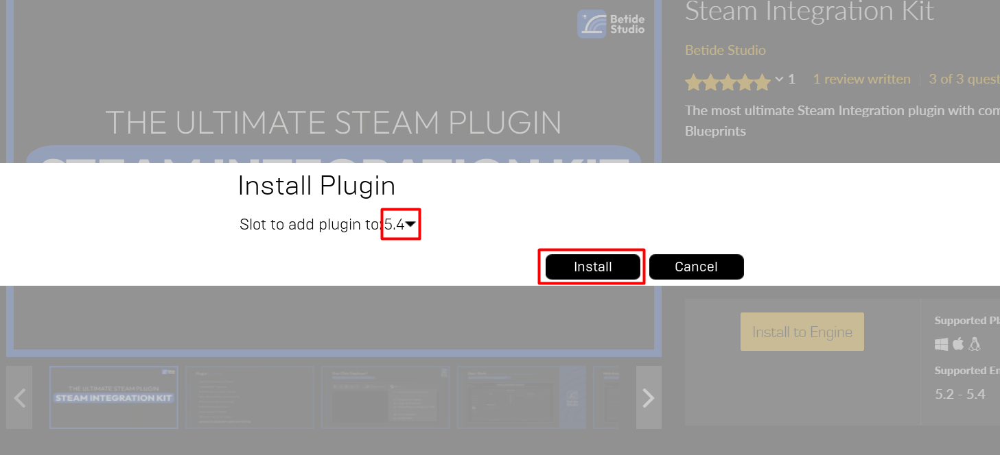
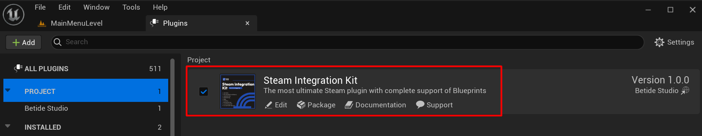

# Plugin Installation

Currently, the plugin is only available on Unreal Engine Marketplace. You can download the plugin from the marketplace and install it in your project.

### Download Plugin

- Open the Epic Games Launcher and install the Plugin to the Engine version you are using.

  

  

And that's it! You have successfully installed the plugin in your project. Now you can start using the plugin in your project.

### Enable Plugin

To enable the plugin in your project, follow the steps below:

- Open your project in Unreal Engine.

- Go to the Edit menu and click on Plugins.

- In the Plugins window, search for the plugin and enable it.

  
