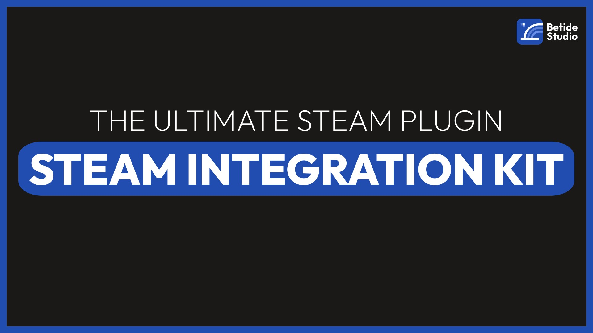

import { Tabs } from 'nextra/components'

# Steam Integration Kit
 
  

The Steam Integration Kit is a powerful plugin designed for Unreal Engine 5, allowing developers to fully leverage the Steam SDK within Blueprints. With this plugin, you can seamlessly integrate Steam's features into your game, including achievements, leaderboards, multiplayer matchmaking, and more, all without needing to write a single line of C++ code. Ideal for indie developers and studios looking to streamline their development process, the Steam Integration Kit offers a robust and user-friendly interface to bring your games to life on Steam.

## Features

- **Achievements**: Easily add Steam achievements to your game with a few simple Blueprints.
- **Leaderboards**: Create and manage leaderboards for your game, allowing players to compete for the top spot.
- **Multiplayer Matchmaking**: Implement Steam's multiplayer matchmaking system to connect players from around the world.
- **Friends List**: Allow players to add friends, see when they're online, and invite them to join their game.
- **Cloud Saves**: Save player data to the Steam Cloud, ensuring that progress is never lost.
- **Workshop Support**: Enable players to create and share mods through the Steam Workshop.
- **Overlay Integration**: Access the Steam overlay to provide players with a seamless experience.
- **And More**: Additional features and functionality to enhance your game's integration with Steam.

## SDK Interfaces Exposed

The Steam Integration Kit provides Blueprints for the following Steam SDK interfaces:

- Apps
- Friends
- Game Server
- Game Server Stats
- Inventory
- Input [Currently Submitted]
- Matchmaking
- Matchmaking Servers
- Music
- Music Remote
- Networking
- Networking Utils
- Parties
- Remote Storage
- Screenshots
- User Generated Content (UGC)
- User
- User Stats
- Utils
- Video

And this is not the end! We have many game specific functions that will help you to integrate Steam features into your game.

## Marketplace vs GitHub Version

The Steam Integration Kit is available on both the [Unreal Engine Marketplace](https://www.unrealengine.com/marketplace/en-US/product/steam-integration-kit) and [GitHub](https://github.com/betidestudio/SteamIntegrationKit). Let's compare the two versions:

- The Github version has to be compiled from source, while the Marketplace version is a pre-compiled plugin.
- Almost all Steam SDK interfaces are available in both versions.
- The Marketplace version is more user-friendly and easier to install and also supports us to continue developing the plugin.

Now some major differences:

- One Click Deployer is available only in the Marketplace version because it uses the Steam SDK binaries, which are not available in the GitHub version.
- The GitHub version uses the Online Subsystem Steam plugin coming with the Unreal Engine, while the Marketplace version uses the modified version of the same.
    **This helps us to support latest version of Steam SDK on the Marketplace version.**
- Now because the Marketplace version uses the modified version of the Online Subsystem Steam plugin, we have many fixed bugs and added new features which are not available in the GitHub version.
- [Coming in Next Update] The Marketplace version uses a single Netdriver for both the Steam and Non-Steam versions of the game, which is not available in the GitHub version.

## Support

If you encounter any issues or have questions about the Steam Integration Kit, please refer to the [documentation](/docs) or contact our [support team](/about) for assistance. We're here to help you make the most of your Steam integration and bring your game to the next level.