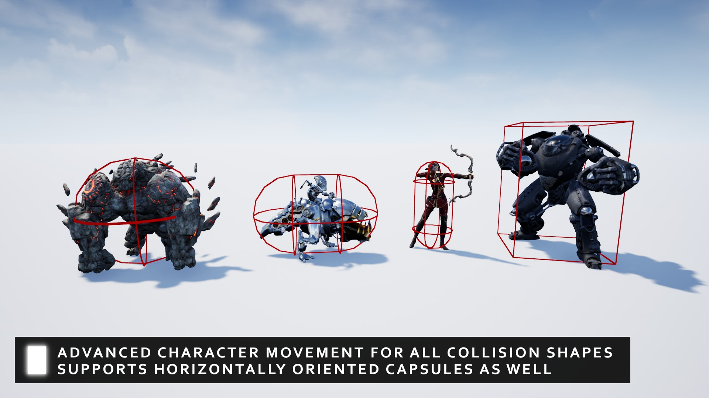

import { Steps } from 'nextra/components'

# GMC v2 Integration

  


[GMC v2](https://www.unrealengine.com/marketplace/en-US/product/general-movement-component?sessionInvalidated=true) is a advanced locomotion & network prediction framework. 

This integration guide was needed because the GMC v2 plugin comes with a custom module for Steam which is not compatible with the Steam SDK that SIK uses.

## Steps to integrate GMC v2 with SIK

<Steps>

### Step 1: Disable Steam Plugin Requirement

In the **GMC.uplugin** file, remove the **OnlineSubsystemSteam** from the **Plugins** section, it should look like this:

```json
	"Plugins": [
		{
			"Name": "EnhancedInput",
			"Enabled": true
		},
		{
			"Name": "StructUtils",
			"Enabled": true
		}
	]
```

### Step 2: Modify Build.cs file

In the **GMCSteam.Build.cs** file, under the **PublicDependencyModuleNames** section, add SIK module like this:

```csharp
    PublicDependencyModuleNames.AddRange(new[] {
      "Core",
      "CoreUObject",
      "Engine",
      "SlateCore",
      "NetCore",
      "OnlineSubsystem",
      "SteamIntegrationKit",
      "UMG",
    });
```
</Steps>


Done! Now you can use GMC v2 with SIK without any issues. Feel free to ask any questions in the Discord server if you face any issues.
