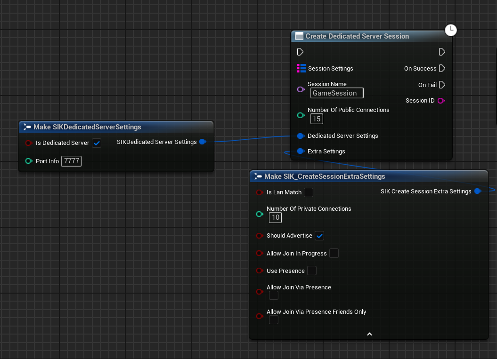
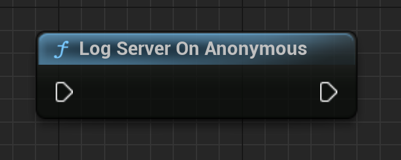
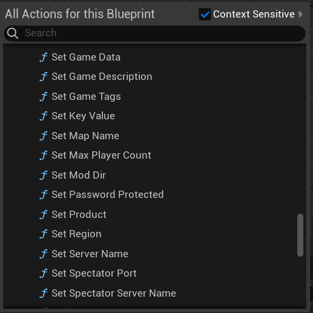
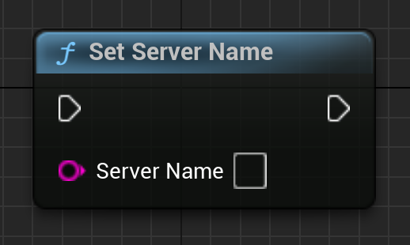
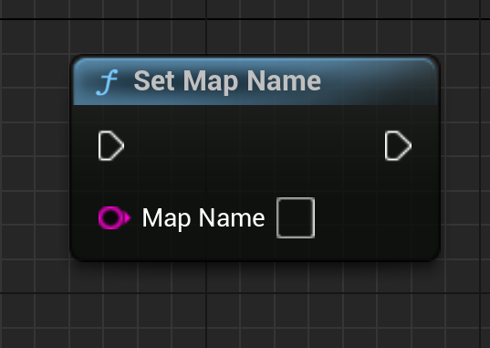
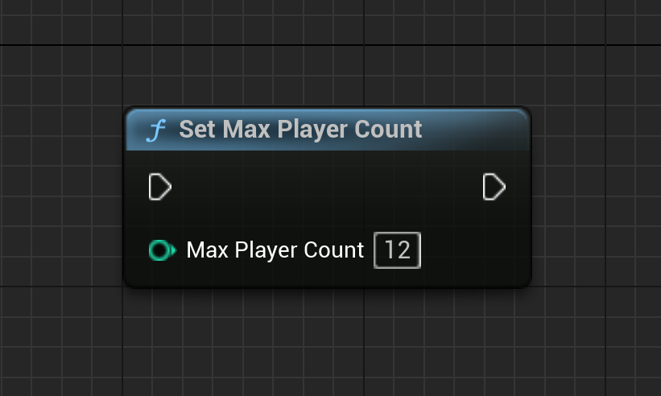
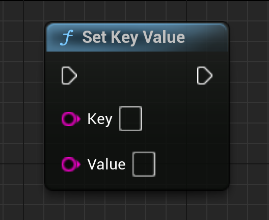

# Dedicated Server sessions
Dedicated server sessions are a way to host a game server on a dedicated server. This is the most common and secure way to implement multiplayer.

## Introduction

Dedicated servers are the most common way to implement multiplayer in games. They are:

- Secure
- Scalable
- Reliable

## How it works

Dedicated servers are game servers that run on a dedicated machine. This machine is usually hosted by a third-party service provider or a virtual machine. The game server is responsible for:

- Hosting the game
- Managing the game state
- Handling player connections

## Requirements

To host a dedicated server, you will need:

- A dedicated machine
- A game server build which can only be made from Source Engine. More info can be found [here](https://partner.steamgames.com/doc/features/multiplayer/game_servers).

## Creating Dedicated Server Session

To create a dedicated server session, you can use the `CreateDedicatedServerSession` function. This function will create a new dedicated server session and return the session ID if it was a success.

  

### Logging in the server for Steam Backend

To log in the server for Steam Backend, you can use the `LogOnAnonymous` function. This function will log in the server to the Steam Backend annoyoymously.

  

### Server Session Properties

There are a lot of functions that you can use to set the server session properties. You can set the server name, the map name, the max players, and many more.

  

Let's talk about a few of them in detail:

#### Set Server Name

Sets the name of server as it will appear in the server browser.

  

#### Set Map Name

Sets the name of map to report in the server browser.

  

#### Set Max Players

Sets the maximum number of players allowed on the server at once.

This value may be changed at any time.

  

#### Set Key Value

Add/update a rules key/value pair.

  

