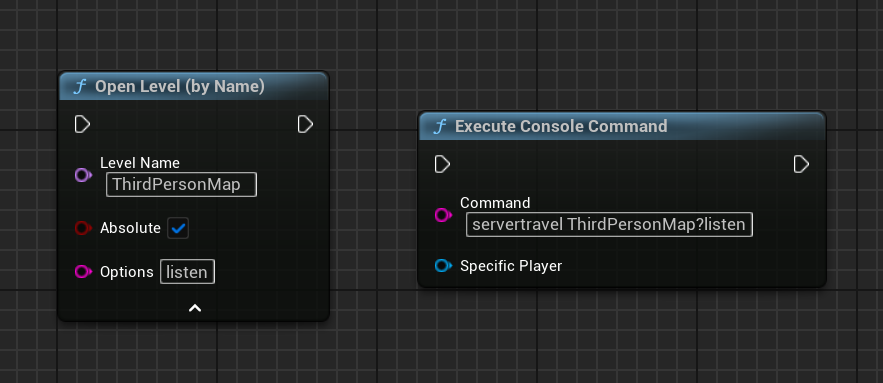
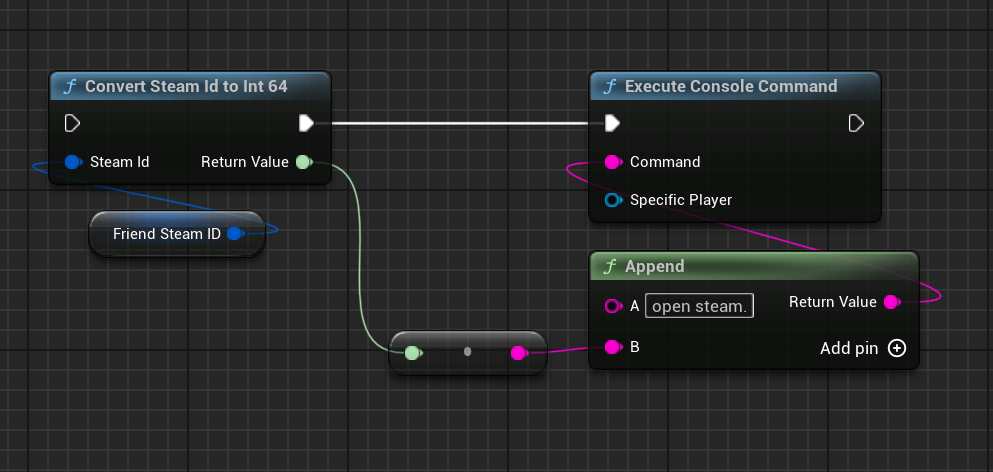

import { Steps } from 'nextra/components'

# Direct P2P Sessios

In this guide, I will explain how to create a direct P2P session with the Steamworks SDK. This is the most common way to use P2P networking with the Steam Integration Kit.

<Steps>
### Creating a P2P Session
 
This should be the easiest part of the guide. Just open the session level with the `listen` tag and the SteamSubsystem will automatically create a new P2P connection.

  

Both of these show methods works the same way!
 
### Joining a session
 
Now to join the session, you can use `Execute Console Command` node with the command `open steam.STEAMIDOFUSER`. This will open the session with the given Steam ID of the user.

  

To get the steamId of any user, you can use the [Friends Interface](/multiplayer/friends) to get the steamId of the user.
</Steps>