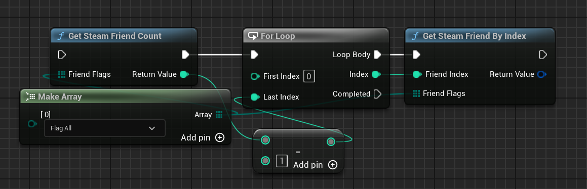
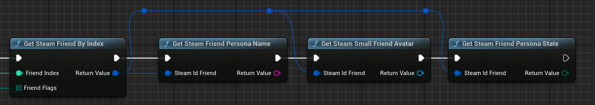
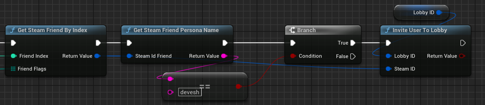
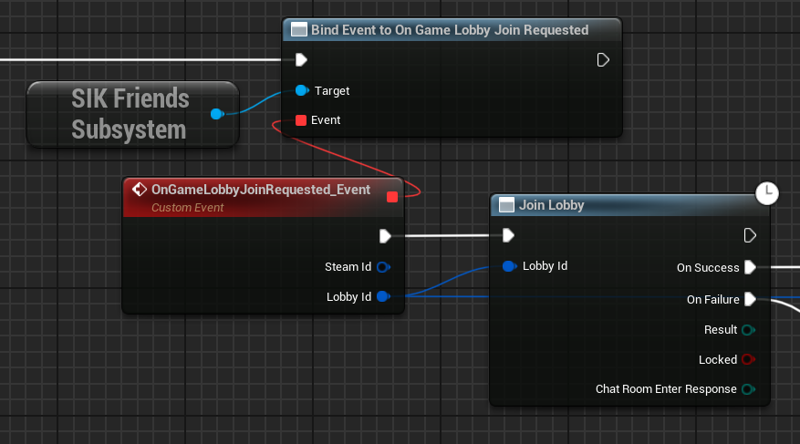
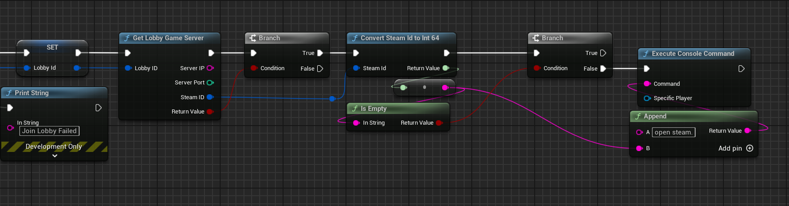

# Friends

Friends are players you have added to your friends list. You can see when they are online and invite them to join your game.

## Get Friend list

To get the list of friends, you first need to get the number of friends you have and then you can just iterate over the list of friends.

  

## Getting Friend Info 

To get the information of a friend, you can use some of the below functions:

  

These functions will return the information of the friend like their name, avatar, etc.

## Invite Friend to Lobby

This one is interesting. You can invite your friend to join your game. You can use the below function to invite your friend.

In this example, we are inviting a friend to join our lobby but again, you can use this function to invite your friend to join your game OR you can use connect string too!

  

### Callback Handling

When the user accepts the invitation, you will get a callback. You can handle the callback and join the user to the lobby

  

### Joining the User to Level

If the Game Server is not connected to the lobby, you can use the callback to game server and join the user to the level when the owner sets the Game Server. Covered in [Lobbies](/multiplayer/lobbies) section.

Now, if you have a lobby joined and the lobby is already connected to the level, you can use the below function to join the user to the P2P Session.

  

Note : For Dedicated Servers, you can use the IP and Port to connect to the server.