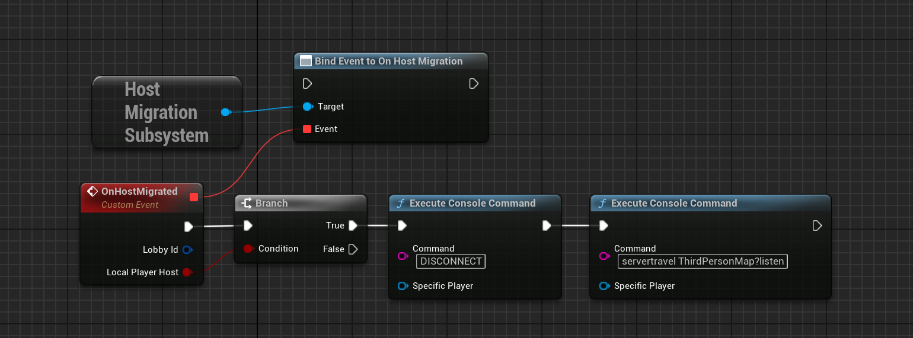
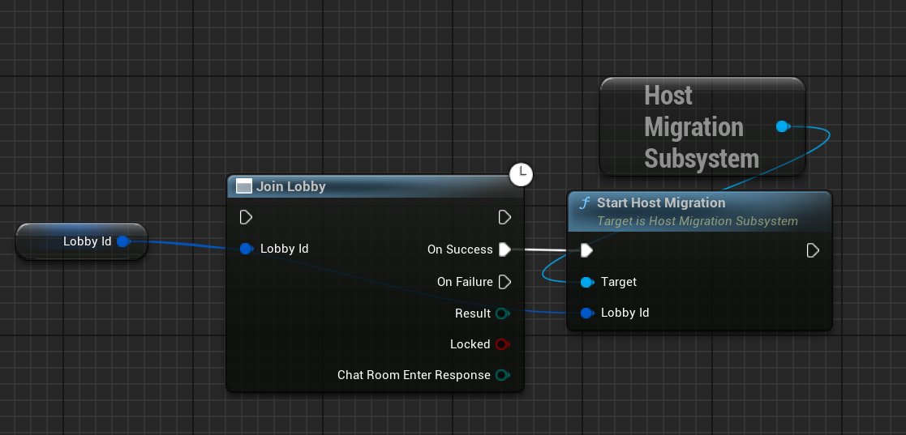

# Host Migration

Host migration is the process of transferring the host of a game from one player to another. This is done to ensure that the game can continue if the original host leaves the game.

Now Steam already has a system in place for this, but it's not for the connected game server/P2P Session.

With this basic system, the game server will be able to transfer the host to another player in the game. This will allow the game to continue without interruption if the original host leaves the game. I mean there will be a small interruption, but it will be better than the game ending.

### New Host Setup 

When the host leaves the game, steam selects the new host and the new host should do the following thing:

  

The level name can change and you should update the level name in the Execute Console Command node.

### Joining Steps

To make sure the host migration works properly, every time a player joins the game, they should do the following:

  

