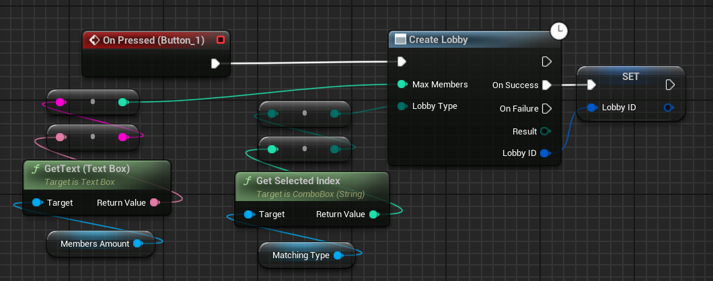
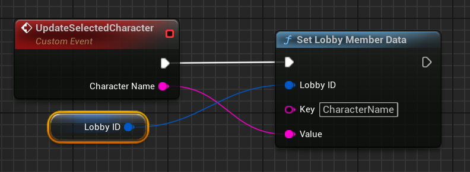
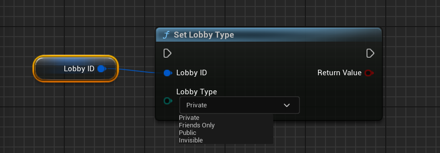
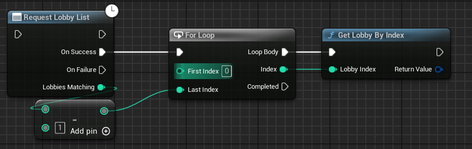
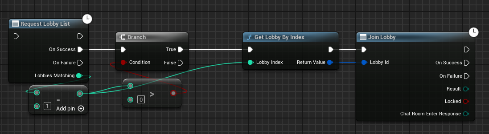
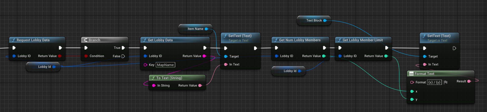
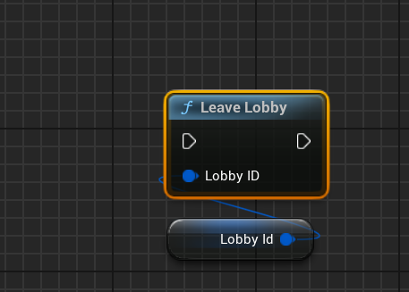
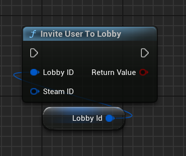

# Lobbies

There are basically two methods to use lobbies with the Steam Integration Kit.

## Direct Steamworks SDK Method

This is the most common way to use lobbies directly with the functions provided by the Steamworks SDK and exposed to Blueprints by Steam Integration Kit.

### Create a Lobby

To create a direct steam lobby, you can use the `CreateLobby` function. This function will create a new lobby and return the lobby ID if it was a success.

Please make sure to store reference to the lobby ID, as you will need it to modify the lobby later.

  

### Update Lobby Data

Now that you have created a lobby, you can update the lobby data, including lobby owner data, lobby member data, and lobby type etc.

#### Set Lobby Data

To update the lobby data, you can use the `SetLobbyData` function. This function will update the lobby data with the given key and value.

  

Like in the above example, we update the map name associated with the lobby. 

#### Set Lobby Member Data

To update the lobby member data, you can use the `SetLobbyMemberData` function. This function will update the lobby member data with the given key and value. Also, just to add, this can only update the local user's data for the lobby.

  

#### Set Lobby Type 

To update the lobby type, you can use the `SetLobbyType` function. This function will update the lobby type with the given type.

  

Please note, this value will just update the option you selected while creating the lobby session.

### Finding Lobbies

To find lobbies, you can use the `FindLobbies` function. This function will find the lobbies return the lobby IDs of found sessions if it was a success.

  

Now that you have the lobby IDs, we can either join the lobby or get the lobby data to display in the UI. Let's talk about both:

#### Joining a Lobby

To join a lobby, you can use the `JoinLobby` function. This function will join the lobby with the given lobby ID.

  

Like in the above example, we get the length of found lobbies, then subtract 1 to get the first Lobby ID and join it. (Remember, the array starts from 0 and that's why we subtract 1)

#### Get Lobby Data

To get the lobby data, you can use the `GetLobbyData` function. This function will get the lobby data with the given key.

`RequestLobbyData` function is used to get the lobby data from the Steam backend. This function is only used to get the data from the Steam backend, and you can use `GetLobbyData` to get the data from the local cache.

  

### Leave Lobby

To leave the lobby, you can use the `LeaveLobby` function. This function will leave the lobby.

  

### Invite Friend to Lobby

To invite a friend to the lobby, you can use the `InviteFriendToLobby` function. This function will invite the friend to the lobby with the given lobby ID.

  

To get the steam ID of the friend, please checkout the [Steam Friends](/multiplayer/steam-friends) section.