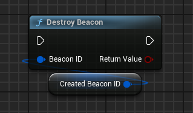

import { Callout } from 'nextra/components'

# Parties (Beacons)

<Callout type="warning">
    While Steam refers to this feature as "Parties," it is not the same as the traditional Party systems found in many games, where a group of players can stay together across matches or experiences. Instead, Steam's "Parties" feature uses the ISteamParties API to facilitate the creation and advertisement of multiplayer game sessions through beacons. These beacons allow players to join a session by reserving slots advertised in Steam's ecosystem, such as chat rooms or other group locations.

    If you want to implement a traditional Party system, you can do it using [Lobbies](/multiplayer/lobbies) as they provide the same functionality.
</Callout>

The ISteamParties API enables developers to create "beacons" that advertise a multiplayer game session in specified locations within the Steam ecosystem, such as chat room groups. This feature is ideal for games that want to allow players to discover and join private or semi-private game sessions.

## Example Use Case

Imagine a game that features private multiplayer lobbies. A developer can:
1. Create a private lobby and generate a game connect string. More info on this can be found in the [Lobbies](/multiplayer/lobbies) section.

2. Get all available beacon locations using **Get Available Beacon Locations** which takes the **Max Number of Locations** as an argument which you can get from **Get Max Available Beacon Locations**.

  

3. After you have selected a location(we are using a random location in this example), you can create a beacon using **Create Beacon** which takes the **Open Slots**, **Location**, **Connect String** and **Metadata** as arguments.

- Open Slots - The number of slots you want to reserve in the beacon.
- Location - The location where you want to advertise the beacon which you got from **Get Available Beacon Locations**.
- Connect String - The connect string of the lobby. If the lobby owner is the same as the user who is creating the beacon, you can pass the lobby owner's Steam ID as the connect string, so that the user can join the session using **open steam.lobbyconnect** URL.
- Metadata - Any additional data you want to send with the beacon. Available in **GetBeaconDetails** node.

  

4. When the user joins the session, you need to inform Steam that the Reservation is complete using **OnReservationCompleted**.

  

5. When the session is ready to start, you can destroy the beacon using **Destroy Beacon**.

  

### Additional Information

If a user joins your party through other matchmaking (perhaps a direct Steam friend, or your own matchmaking system), your game should reduce the number of open slots that Steam is managing through the party beacon. To do this, you can call **Change Num Open Slots** with the new number of open slots.

  

## Client-Side Functions

Seeing and following beacons - can also be managed by the game.

1. You can get number of active beacons using **Get Num Active Beacons** and then get the beacon id using **Get Beacon By Index**.

  

2. Now, when you have a beacon id selected, you can get the details of the beacon using **Get Beacon Details**.

  

3. Now, you can join the beacon using **Join Party**.

  

That is it! If you have any questions, feel free to join our [Discord](https://discord.gg/betidestudio) or email us at [support@betide.studio](mailto:support@betide.studio).
