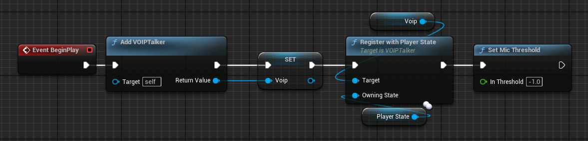
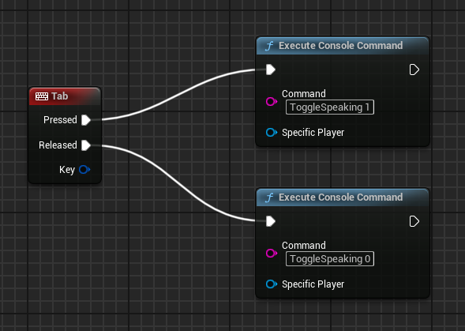
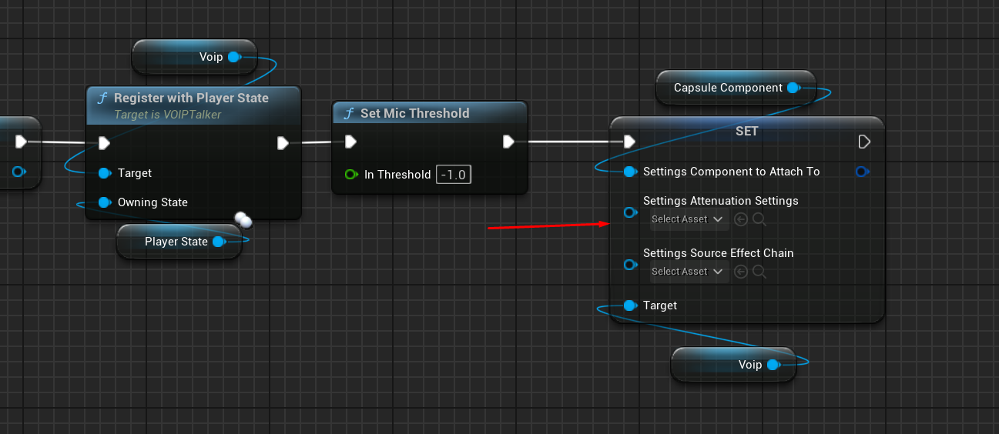
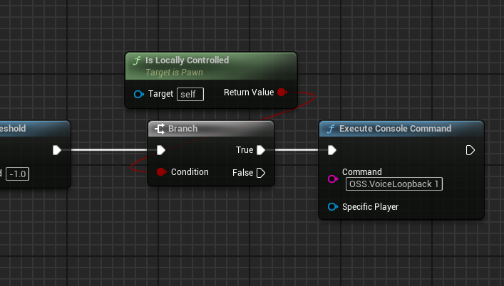

import { Callout } from 'nextra/components'

# Voice Chat with SIK

<Callout type="info">
    This feature is implemented in version 1.6.2 of Steam Integration Kit.
</Callout>


## Config Changes

To enable Voice Chat, you need to make some changes in the configuration files. You need to enable Voice Chat in the DefaultEngine.ini and DefaultGame.ini files.

```ini copy showLineNumbers filename="DefaultEngine.ini"
[OnlineSubsystem]
DefaultPlatformService=Steam
bHasVoiceEnabled=true

[Voice]
bEnabled=true
```

```ini copy showLineNumbers filename="DefaultGame.ini"
[/Script/Engine.GameSession]
bRequiresPushToTalk=true
```


## Character Blueprint Changes

Time for the game changes, you need to Add VOIPTalker and then register it with the Player State. Please note that PlayerState may not be available instantly, so you should check if it is valid before registering the VOIPTalker.

  

## Enable/Disable Speaking

To enable speaking, you need to Toggle Speaking. You can use the below function to toggle speaking.

  


## Positional Voice Chat

To turn this into a positional voice chat, after setting the Mic Threshold, you need to modify the VOIPTalker settings and set a **Component to Attach to** and **Attenuation Settings**.

  

## Self Listening Test

You can turn VoiceLoopback to test if your voice is being transmitted correctly.

  

