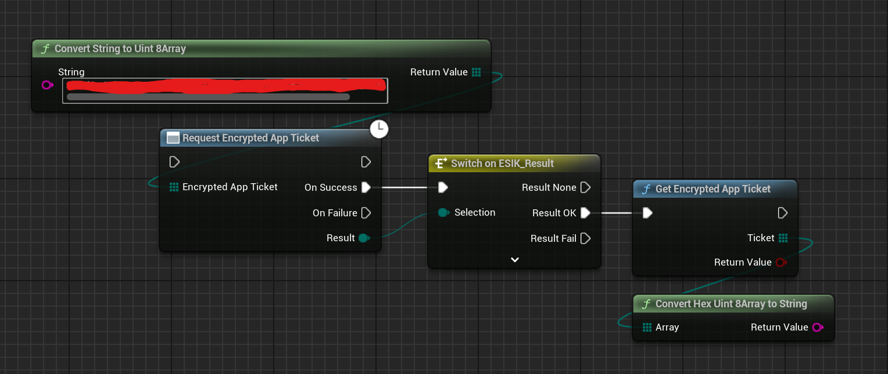
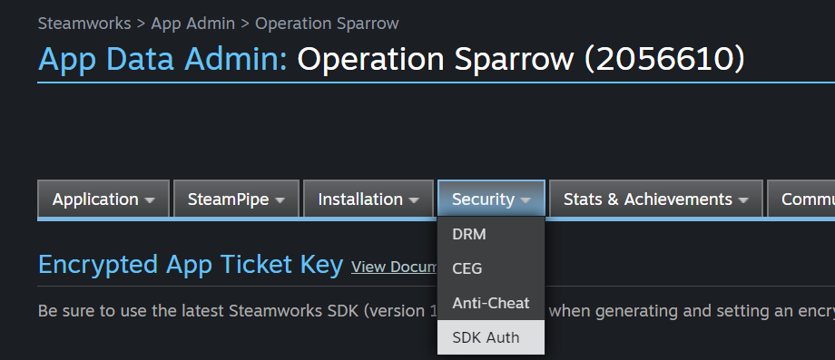

# Encrypted App Tickets

Steam has a feature for developers to create encrypted app tickets. These tickets are to login players into services like Mod.io & EOS (older versions). This is a guide on how to create and grab these tickets.

  

The red hidden value is the Encrypted App Ticket Key. This key is used to encrypt the app ticket and is used to decrypt the app ticket. You can find this key in the *App Data Admin* section of your Steamworks page.

  

That is it! You can pass the string value to those services to authenticate the player.