# Steam Input

Before I start, I want to say that this is the first time I've ever used Steam Input, so I'm not an expert on it`s features. I'm just going to show you how to use it and how to set it up.

Incase you are interested in deeper information, you can check the official documentation [here](https://partner.steamgames.com/doc/features/steam_controller/getting_started_for_devs).

## What is Steam Input?

Steam Input is a feature that allows you to use any controller you want to play games on Steam. It also allows you to customize your controller to your liking. You can change the button layout, sensitivity, and even create your own controller configurations.

## How to use Steam Input?

### 1. Creating an In-Game Actions File

- Download the [In-Game Actions File](https://steamcdn-a.akamaihd.net/steam/partner/controller/game_actions_X.vdf). 

- Open the file with a text editor and change the `X` in `game_actions_X.vdf` to the AppID of the game you want to create the configuration for. You can find the AppID of a game by going to the game's store page on Steam and looking at the URL.
    For example, if you want to create a configuration for SpaceWar, the AppID is 480. So the file name would be `game_actions_480.vdf`.

- Put the file in the `C:\Program Files (x86)\Steam\controller_config` directory. (If you have Steam installed in a different directory, replace `C:\Program Files (x86)\Steam` with the path to your Steam installation directory. Also, note that the `controller_config` directory may not exist, so you may need to create it.)

More information about the In-Game Actions File can be found [here](https://partner.steamgames.com/doc/features/steam_controller/iga_file).

### 2. Creating a Controller Configuration

- Now open Steam and under *View*, click on *Big Picture Mode*.

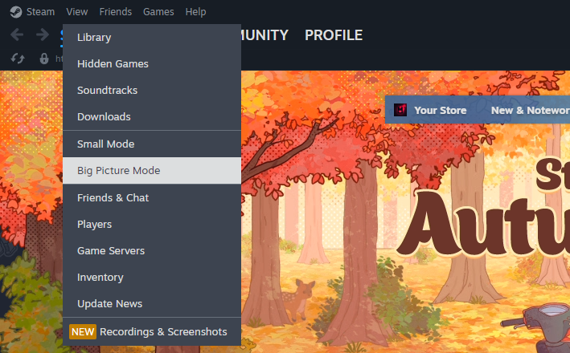  

- Left click on the game you want to create a configuration for.

- Click on the *Controller Icon*.

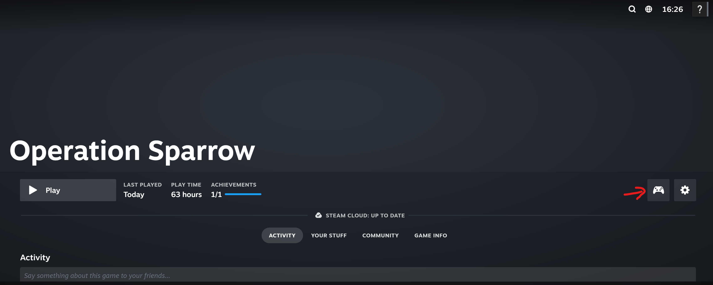  

- If the page says that Steam Input support is disabled, click on it and select *Enable Steam Input*.

- Now press on **Edit layout**.

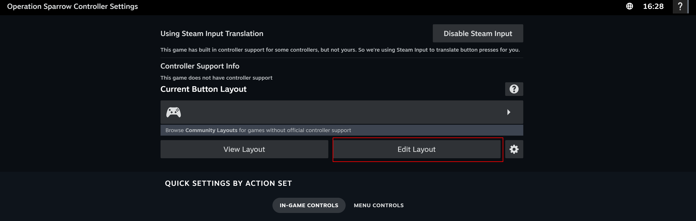  

- You can now customize your controller to your liking. The name of the config should be the same as you set in the In-Game Actions File.

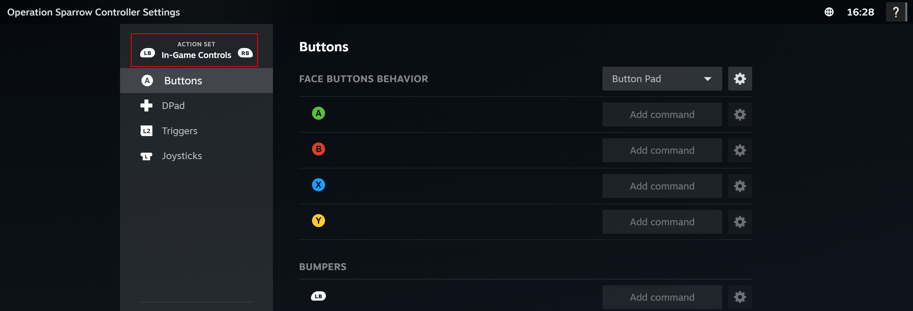  

- If you don't receive any errors, you're now looking at an empty controller configuration for your game, and it should be fully aware of your in-game actions. Use the UI to create a default configuration. Make sure you set defaults for all your in-game action sets, not just the first one.

Once you've got a configuration, save it privately. Don't publish it, because your game is not yet ready to receive IGAs.

To show this working, I have set up a simple configuration for the game. You can see the configuration below.

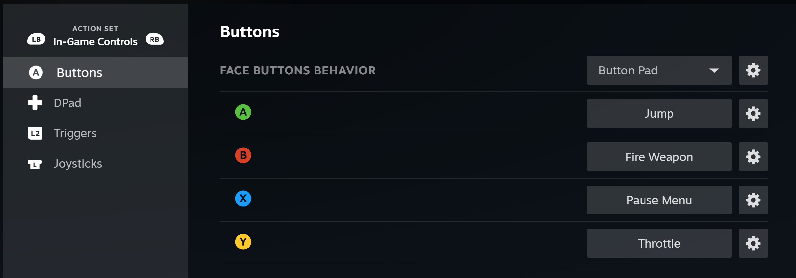  

### 3. Blueprint Integration

#### 3.1. Init Steam Input

- First, you need to initialize Steam Input. You can do this by calling the `Init` function in the `ISteamInput` interface.

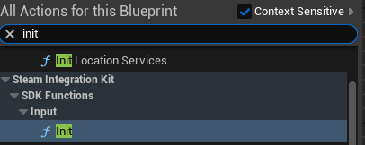  

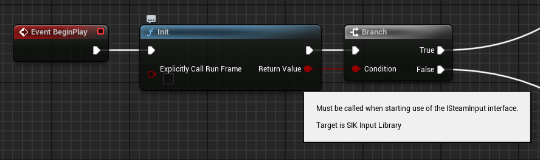  

#### 3.2. Get Controller Config

So, your player may have multiple controllers connected and you would need to get the one that is being used. For most of the entries, the return of the follow function will be unknown, except for the one that is being used.

So, from the array, we find the one we want to use and save it in a variable. You may need to do this for each controller you want to use.

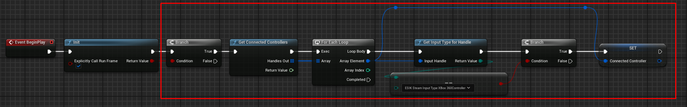  

#### 3.3. Activate Action Set

- Now you need to activate the action set. You can do this by calling the `ActivateActionSet` function in the `ISteamInput` interface.

We will use the controller config we got in the previous step and activate the action set.

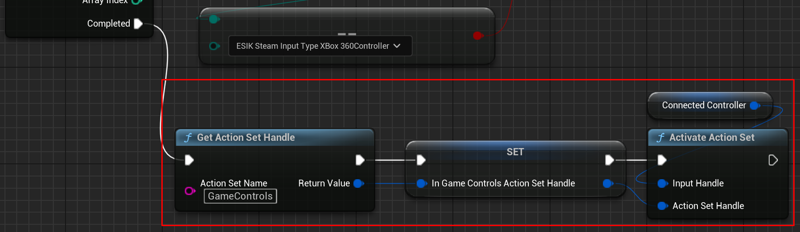  

#### 3.4. Example : Move Player

- Now you can use the controller to move the player. You can do this by calling the `Get Analog Action Data` function in the `ISteamInput` interface.

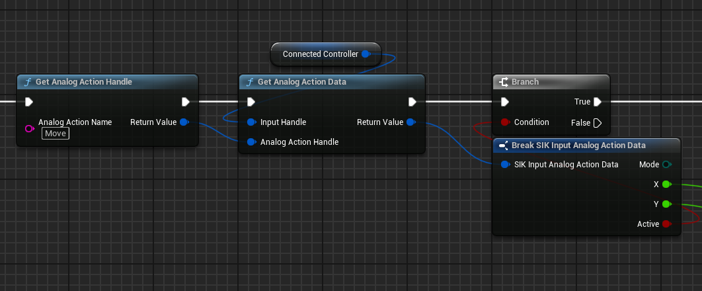  

- You can also use the `Get Digital Action Data` function to get the digital action data, for example, to jump.

### 4. Uploading the Configuration

- Once you have created a configuration for your game, you can upload it to Steam. 

- To do this, on the Steam Input configuration page, select *Custom Configuration* and upload your configuration.

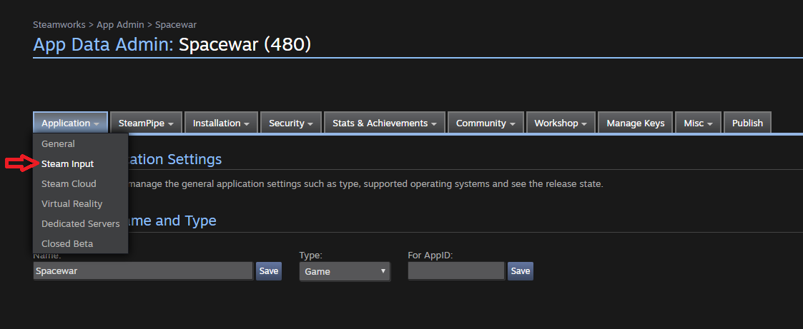  

- And from the selection below, select "Add Custom Configuration."

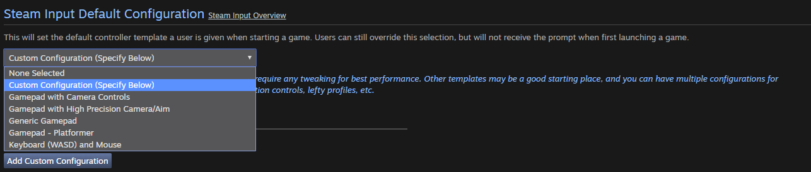  

-Paste the file ID of your public configuration into the box, and click the OK button.

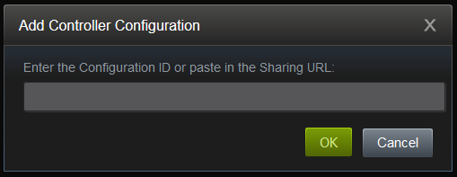  

Done! Now you have a basic understanding of how to use Steam Input. You can now customize your controller to your liking and create your own controller configurations. 