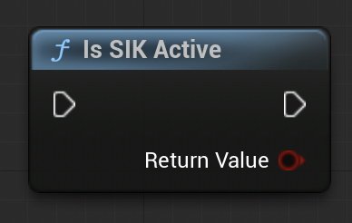

# Game Ownership with SIK

Ensuring game ownership with the Steam Integration Kit (SIK) is a straightforward process.

If the user doesn't own the game, Steam libraries won't initalize, nor will SIK subsystem. Hence, you can use **Is SIK Active** to check if SIK is running.

### Important Considerations

The Is SIK Active function may return false under the following conditions:

- The Steam SDK is not present.
- The Steam Client is not running

Most of it can be tackled by using the following steps.

### Preparing for Game Release
For release builds:

- Always make Shipping Builds.
        This ensures the game is launched directly from Steam, preventing unauthorized access.

For development builds:

- Enable the Relaunch in Steam option to simulate ownership checks.
  - Location: Project Settings → Game → Steam Integration Kit.