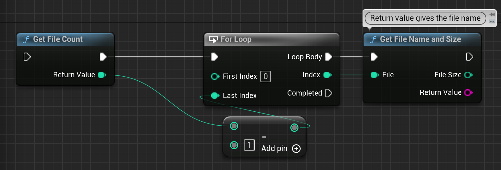
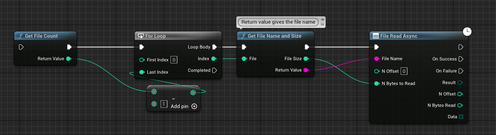
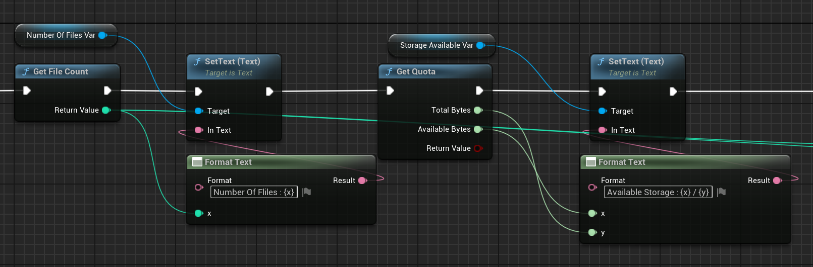

# Remote Storage

The Remote Storage module allows you to store files in Steam Cloud. This module is useful for storing files that are not required to be stored locally. For example, you can store save files, player profiles, and other data that is not required to be stored locally.

### Getting stored files

To get the files stored in a remote storage, you can use the following function:

  

### Reading a file

To read a file from a remote storage, you can use the following function:

  

### Extra Functions
To get the number of files in a remote storage and the Quota of the storage, you can use the following functions:

