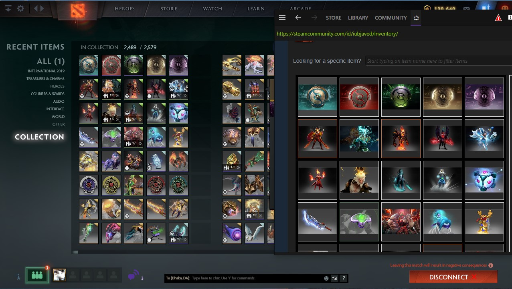
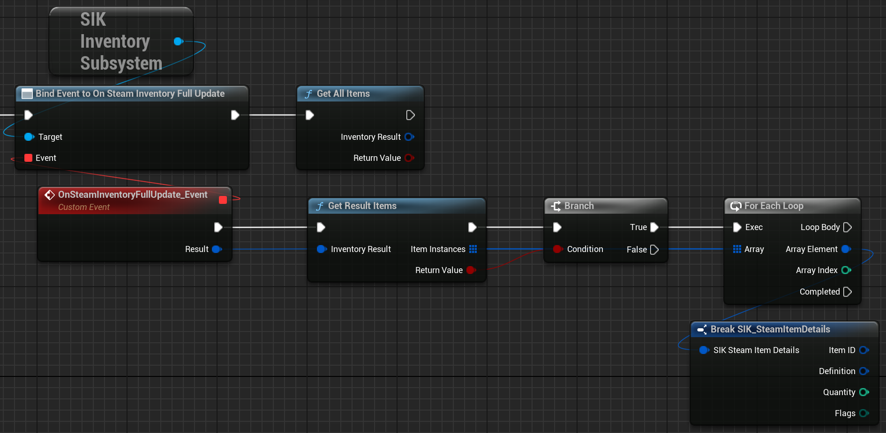
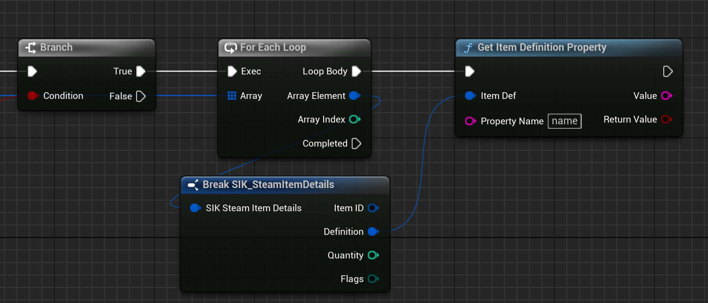

# Purchased Items
  

So you have successfully created a store item and now you want to fetch the purchased items from the Steam backend. In this guide, I will show you how to fetch the purchased items from the Steam backend using SIK.

## Grab Purchased Items

To fetch the purchased items, you need to call the `Get All Items` method from the `Inventory Subsystem`

  

## Get Item Details

Once you have the purchased items, you can get the details of each item by calling the `Get Item Definition Property` method from the `Inventory Subsystem`

  

That is it! Feel free to reach out to us in case you have any queries.
