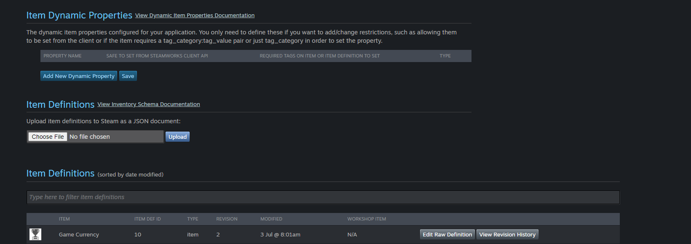

# Store Items

Store Items are items that can be purchased with Steam Overlay. These items can be anything from in-game currency to cosmetic items. In this guide, we will show you how to create and manage store items in your game.

## Enable Inventory Service

To create a new store item, you need to follow these steps:

1. Open the [Steamworks Developer](https://partner.steamgames.com/apps) site and log in with your Steam account.

2. On the Steamworks Developer site, click on Steamwork Settings and go to `Inventory Service` under `Community`.

    You can also use the following direct link but make sure to change your appid in the end of the link:
    
    https://partner.steamgames.com/apps/inventoryservice/{appid}
    
     


3. On the Inventory Service page, make sure to enable the Inventory Service for your game.

    


## Create a New Store Item

Before creating a item, we need to get the [ItemDef](https://partner.steamgames.com/doc/features/inventory/schema) schema ready. I am going to use a basic schema for this guide which I am sharing below. 

Please note, this is the only way to get the item info right! All info like Images, Prices, Description go into this Json schema.

1. Create a new empty Json file and paste the `ItemDef` schema in it. I am sharing a basic schema below and if you are using the same, please make sure to change the `appid` and `itemdefid` as per your game.

`Item10.json:`

```json     
{
	"appid": 2056610,
	"items": [
	{
		"itemdefid": 10,
		"type": "item",
		"name": "Game Currency",
		"name_color":  "7D6D00",
		"price": "1;USD99",
		"background_color":  "3C352E",
		"item_slot": "Currency",
		"icon_url": "https://i.ibb.co/H7ypYhr/Achieved.jpg",
		"icon_url_large": "https://i.ibb.co/H7ypYhr/Achieved.jpg",
		"tradable": true,
		"marketable": true
	}]
}
```

2. On the Inventory Service page, upload the `ItemDef` schema file.

    

    
    Now reload the page and you will see the item you just created under the `Item Definitions` section.

      


## Fetching the Store Items from Steam Backend

Loading the store items from the Steam backend is a simple process. Sharing the code for the process below :

<iframe src="https://blueprintue.com/render/0m0dm7xp/" scrolling="no" allowfullscreen width="100%" height="400px"></iframe>
Cannot view the code? [Click here](https://blueprintue.com/blueprint/gochho-e/)

## Purchase Store Item

After you have the ItemId from the above code, you can use the `StartPurchase` function to purchase the item. Sharing the code for the process below :

Important Note : This is a basic implementation where I just used the `ItemDefId` to purchase the item.

  
