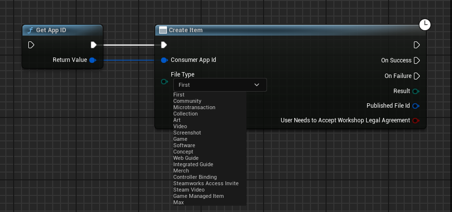

import { Callout } from 'nextra/components'

# Steam Workshop Integration

## Introduction

The Steam Workshop is a platform that allows players to create, share, and download user-generated content for games on Steam. With the Steam Workshop, developers can enable players to create mods, maps, items, and more, and share them with the community. This guide will show you how to integrate the Steam Workshop into your Unreal Engine 5 project using the Steam Integration Kit.

## Prerequisites

- Before you start integrating the Steam Workshop into your Unreal Engine 5 project, you need to enable Steam Cloud Storage and Steam Workshop support in your Steamworks Settings.

    Under Steamwork Settings, go to the Steam Cloud section under Application Settings and set the size of the Steam Cloud Storage to a usable value. This will enable Steam Cloud Storage for your game.

      

- The file size limit of Preview Image is 1MB.

## Creating & Updating Workshop Items

The process to do the same is very simple. You just need to follow the below steps:

- Create a new item on the Steam Workshop using the function
- Update that item with the required information like title, description, image and content.

### Creating a New Workshop Item

To create a new workshop item, you just need to use the `Create Item` function. This function will create a new item on the Steam Workshop and return the **PublishedFileId** of the item. We will use this **PublishedFileId** to update the item later.

  

### Updating a Workshop Item

<Callout type="warning">
    For the below code, if any of the item setters fail, like Set Item Title or Set Item Description, the item will not be updated. EACH SETTER IS IMPORTANT AND RETURN VALUE SHOULD BE CHECKED.
</Callout>

Now the above created item can be updated using the `Submit Item Update` function, combined with the functions for updating each info.

  

<iframe src="https://blueprintue.com/render/xp7swfqw/" scrolling="no" allowfullscreen width="100%" height="400px"></iframe>
Cannot view the code? [Click here](https://blueprintue.com/blueprint/xp7swfqw/)

**Note**: For the content setter, you need to pass the folder path where the content is stored and the whole folder will be uploaded. It's not recommended to zip the content and upload it as the function will not be able to extract the content from the zip file. For Image Setter, it needs to be the absolute path of the image file.

## Getting Workshop Items

This call is made of two separate functions:

- `Create Query User UGC Request` - This function is used to create a query request for the user's UGC items and with the return value, you can modify the query request with tags, name, etc.
- `Send Query User UGC Request` - This function is used to send the query request to the Steam backend and get the items.

  

## Downloading Workshop Items

Downloading workshop items is a simple process. You just need to use the `Download Item` function and pass the **PublishedFileId** of the item you want to download. This function will download the item and save it to the Steam's content folder on the user's machine.

  

### Example Usecase

Let's say you have a game where players can create custom levels and share them with others. Then, in that case, you can access the downloaded folder from the location of the `Get Item Install Info` function and load the level from there. (You can use a pak install plugin if you want)

