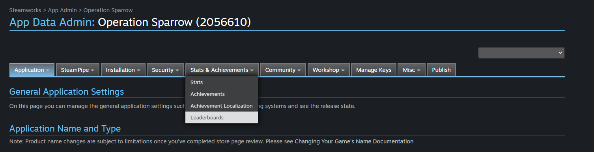
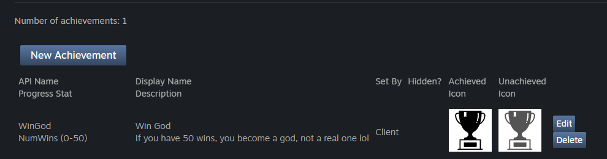
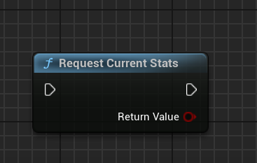
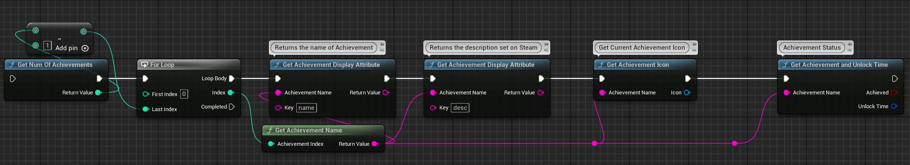

# Achievements

Adding achievements to your game is a great way to encourage players to explore all the features and content you have to offer. Achievements can be used to reward players for completing specific tasks, reaching certain milestones, or mastering certain skills.

## Adding a New Achievement

To add a new achievement to Steam, you need to follow these steps:

1. Open the [Steamworks Developer](https://partner.steamgames.com/apps) site and log in with your Steam account.

2. On the Steamworks Developer site, click on Steamwork Settings and then find the Achievements page. 

   You can also use the following direct link but make sure to change your appid in the end of the link:
   
   https://partner.steamgames.com/apps/achievements/{appid}
   
    

3. On the Achievements page, press on New Achievement and you will see a very bad UI to create a new achievement lol. After you fill all the fields, press Save.

    Just to add, make sure to add the stat first before creating the achievement. If you don't have a stat, you can follow the [Player Stats](/userstats/playerstats) guide to create one.

      

4. Now refresh the Steamworks page and you will see the achievement you just created.
    
## Fetching the Achievements from Steam Backend    

To fetch the achievements from Steam backend, you need to use the `RequestCurrentStats` node.

Here is an example of how you can fetch the achievements from Steam backend:

## Get Achievement in-game from Local Value

To fetch the achievement in-game, you need to use the `GetNumAchievement` class along with getting the values. Here is an example of how you can fetch the achievement in-game:

  

Note: The `GetAchievementIcon` node returns the CURRENT achievement icon that is if it's unlocked, it will return the unlocked icon, else the locked icon.

## Updating the Achievement in-game

As you know, Achievements are linked with stats. So, to update the achievement in-game, you have to update the stat linked with the achievement which will automatically update the achievement.

Check the [Player Stats](/userstats/playerstats) guide to know how to update the stats in-game.