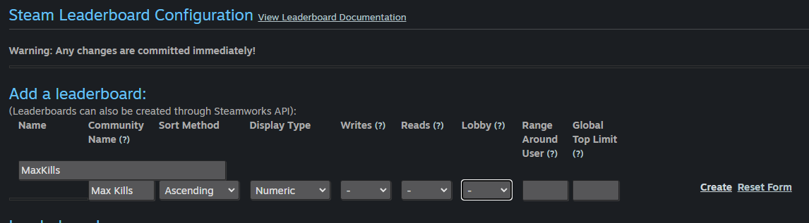
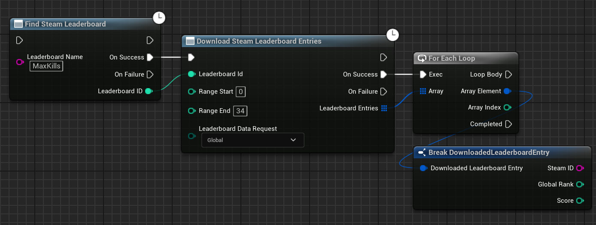
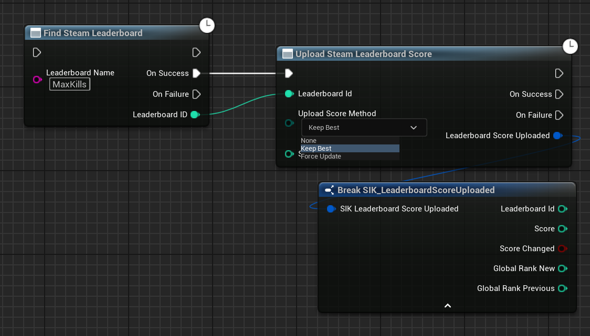

import { Callout } from 'nextra/components'

# Leaderboards

Adding a leaderboard to your site is a great way to encourage competition and engagement among your users. You can create leaderboards for a variety of activities, such as most active users, highest scores, or most comments.

<Callout type="info">
  Stats used for Leaderboards are not same as Player Stats. Consider leaderboard stats as a separate entity. Hence, you have to update the leaderboard stats separately.
</Callout>

## Adding a New Leaderboard

To add a new leaderboard to Steam, you need to follow these steps:

1. Open the [Steamworks Developer](https://partner.steamgames.com/apps) site and log in with your Steam account.

2. On the Steamworks Developer site, click on Steamwork Settings and then find the Leaderboards page. 

   You can also use the following direct link but make sure to change your appid in the end of the link:
   
   https://partner.steamgames.com/apps/leaderboards/{appid}

     

3. On the Leaderboards page, configure the values like the leaderboard's name, Display Type, Sort Method, and other properties and then press Create.

     

4. Now refresh the Steamworks page and you will see the leaderboard you just created.

## Fetching the Leaderboard from Steam Backend

To fetch the leaderboard from Steam backend, you need to use two nodes, `FindSteamLeaderboard` and `DownloadSteamLeaderboardEntries`.

Here is an example of how you can fetch the leaderboard from Steam backend:

If you see in the above image, we can just break the struct response and we will get the leaderboard entries. 

## Updating the Leaderboard in-game

To update the leaderboard in-game, you need to use the `UploadSteamLeaderboardScore` node.

For the method, you can use `ForceUpdate` to update the leaderboard score to the new value or `KeepBest` to keep the best score between the new and old value.

Here is an example of how you can update the leaderboard in-game:

  
