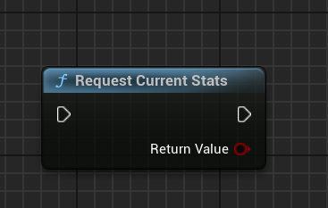

import { Callout } from 'nextra/components'

# Player Stats

Adding a new player stats to Steam and then modifiying it in-game is a simple process, thanks to Steam Integration Kit. This guide will walk you through the steps to add a new player stat to Steam and then modify it.

## Adding a New Player Stat

To add a new player stat to Steam, you need to follow these steps:

1. Open the [Steamworks Developer](https://partner.steamgames.com/apps) site and log in with your Steam account.

2. On the Steamworks Developer site, click on Steamwork Settings and then find the Stat's page. 
   
   You can also use the following direct link but make sure to changhe your appid in the end of the link:
   
   https://partner.steamgames.com/apps/stats/{appid}

     

3. On the Stats page, click on the "Add Stat" button and configure the new stat. You can set the stat's name, type, and other properties.

  

Do press Save to save the stat ;)

## Fetching the Player Stat from Steam Backend

To fetch the player stat from Steam backend, you need to use the `RequestCurrentStats` node:

  

## Get Player Stat in-game from Local Value

<Callout type="info">
  Make sure to first fetch the player stat from Steam backend before trying to load the player stat in-game.
</Callout>

To fetch the player stat in-game, you need to use the `GetStat{Type}` class. Here is an example of how you can fetch the player stat in-game:

The two valid types are `Int` and `Float`.

  

## Modifying the Local Player Stat in-game

As you see in the image below, we have a few stats already added to the game. Let's use one of them to modify it in-game.

  

To modify the player stat in-game, you need to use the `SetStat{Type}` class. Here is an example of how you can modify the player stat in-game:

  

## Submitting the Player Stat to Steam Backend

To submit the player stat to Steam backend, you need to use the `StoreStats` node:

  
