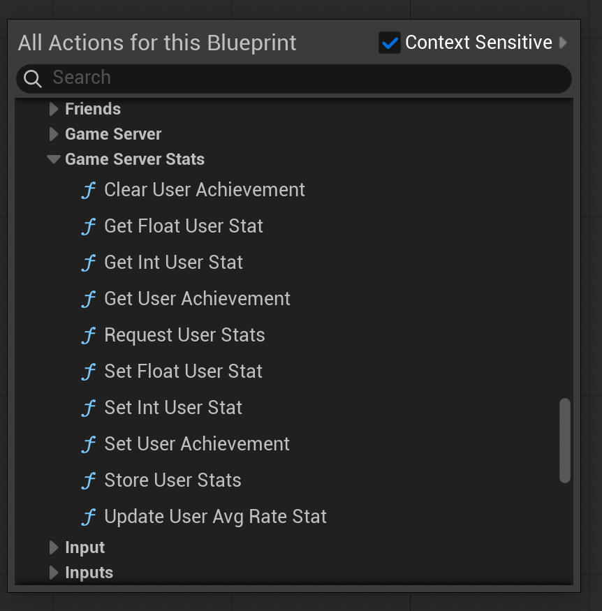

import { Callout } from 'nextra/components'

# Server Functions for User Stats

As you would have seen till now, the functions we used till now majorly were client functions. But for stats, sometimes, it's bad if the client is responsible for uploading the stats.

To fix this issue, Steam provides a server interface, [**ISteamGameServerStats**](https://partner.steamgames.com/doc/api/ISteamGameServerStats) interface, which can control things like updating, clearing & getting user stats and achievements.

<Callout type="warning">
    There are two types of server, *Official Game Servers* and *normal* servers. If you know the IP of the servers that will be updating the stats, then you can add the IP's under [Dedicated Servers](https://partner.steamgames.com/apps/dedicatedservers/) section of App Admin.

   </Callout>

## Functions

You can call any of the following functions, on a game server, in the same way you do the client calls

This will work only on stats & achievements that game servers are allowed to set that is, the "Set By" field for this achievement is "Official GS" or "GS".